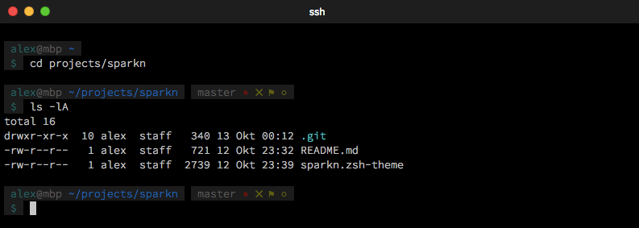
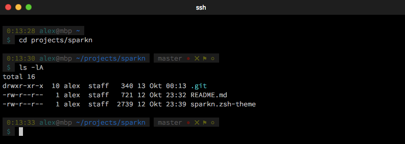
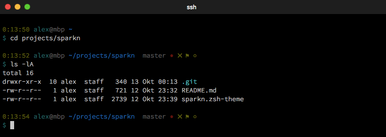
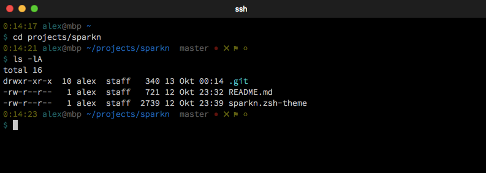
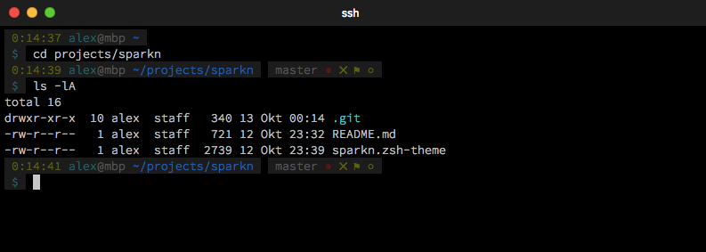
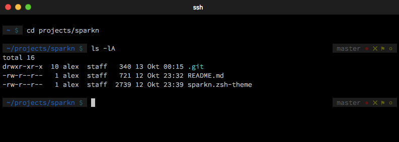
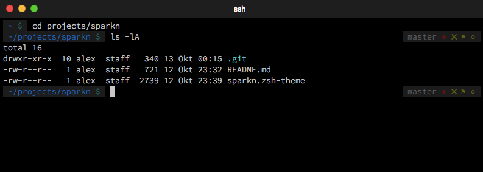
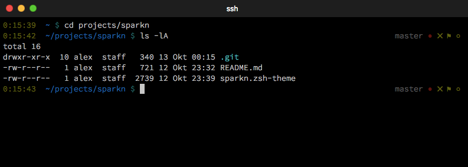

# Sparkn Theme for Oh my ZSH!

To learn more about Oh my ZSH!, visit [ohmyz.sh/](http://ohmyz.sh/)

## Installation

To install Sparkn Theme, place the file sparkn.zsh-theme in the custom folder of Oh my ZSH!  
`~/.oh-my-zsh/custom/spark.zsh-theme`

To use Sparkn Theme, set it in your `.zshrc`.
```bash
ZSH_THEME="sparkn"
```

## Setup

You can set some options in your `.zshrc` file to control this theme.
```bash
ZSH_THEME_SPARKN_COMPACT  true | false (default)
ZSH_THEME_SPARKN_WITH_BG  true (default) | false
ZSH_THEME_SPARKN_WITH_TIME  true | false (default)
ZSH_THEME_SPARKN_WITH_NEWLINE  true (default) | false
```
## Screenshots

Some examples with different settings:

Default settings  


ZSH_THEME_SPARKN_WITH_TIME=true  


ZSH_THEME_SPARKN_WITH_TIME=true  
ZSH_THEME_SPARKN_WITH_BG=false  


ZSH_THEME_SPARKN_WITH_TIME=true  
ZSH_THEME_SPARKN_WITH_BG=false  
ZSH_THEME_SPARKN_WITH_NEWLINE=false  


ZSH_THEME_SPARKN_WITH_TIME=true  
ZSH_THEME_SPARKN_WITH_NEWLINE=false  


ZSH_THEME_SPARKN_COMPACT=true  


ZSH_THEME_SPARKN_COMPACT=true  
ZSH_THEME_SPARKN_WITH_NEWLINE=false  


ZSH_THEME_SPARKN_COMPACT=true  
ZSH_THEME_SPARKN_WITH_TIME=true  
ZSH_THEME_SPARKN_WITH_BG=false  
ZSH_THEME_SPARKN_WITH_NEWLINE=false  


---
If you want to write your own theme, check out these [instructions](https://github.com/robbyrussell/oh-my-zsh/wiki/Customization#overriding-and-adding-themes).
